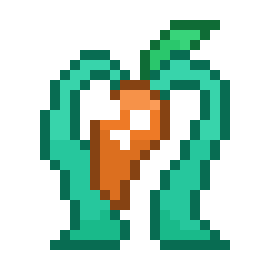
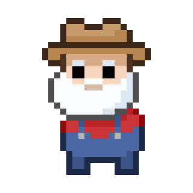

<b> Hi, I'm Evelyn</b>

         

 
         

<!--
**zhixuanevelynwu/zhixuanevelynwu** is a ✨ _special_ ✨ repository because its `README.md` (this file) appears on your GitHub profile.

Here are some ideas to get you started:

- 🔭 I’m currently working on ...
- 🌱 I’m currently learning ...
- 👯 I’m looking to collaborate on ...
- 🤔 I’m looking for help with ...
- 💬 Ask me about ...
- 📫 How to reach me: ...
- 😄 Pronouns: ...
- ⚡ Fun fact: ...
-->
- I'm a Computer Science student at Carnegie Mellon University
- I'm interested in algorithm design and multimedia development
- I’m looking to collaborate on 2D/3D/VR/AR Games and interactive media projects
- Visit my [personal website](http://33v335.com/) to view more of my works

  

### Tech Stack

 

&nbsp;
&nbsp;
&nbsp;
&nbsp;
&nbsp;
&nbsp;

&nbsp;
&nbsp;
&nbsp;
&nbsp;
&nbsp;
&nbsp;
&nbsp;

&nbsp;
&nbsp;
&nbsp;
&nbsp;

&nbsp;
&nbsp;
&nbsp;

